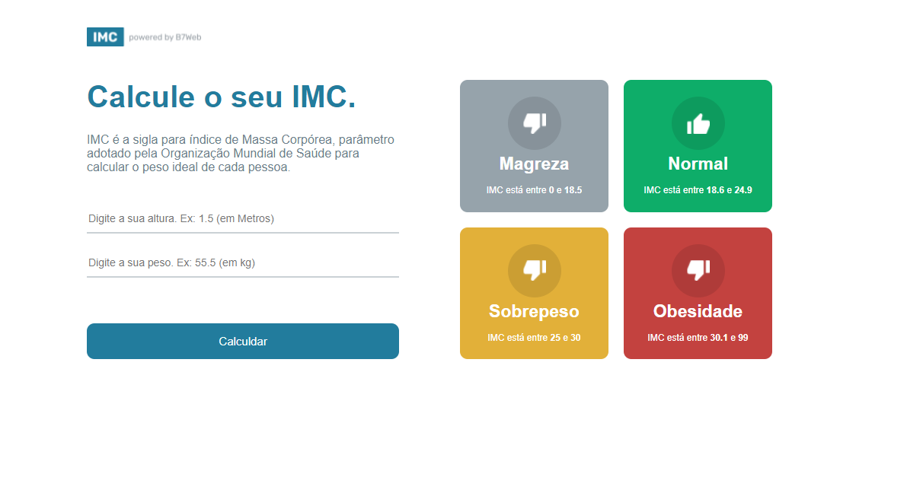
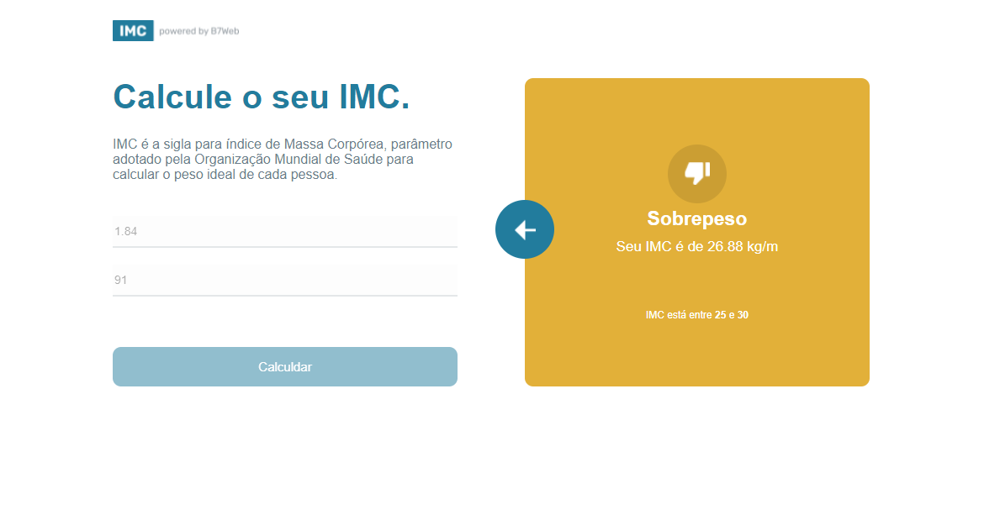
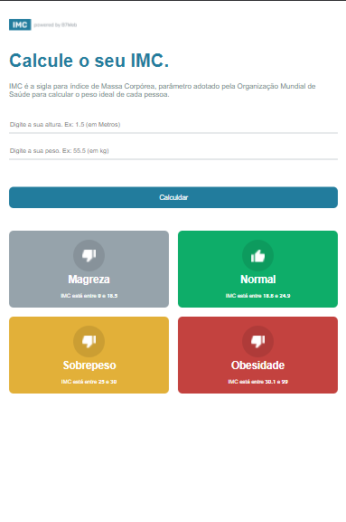
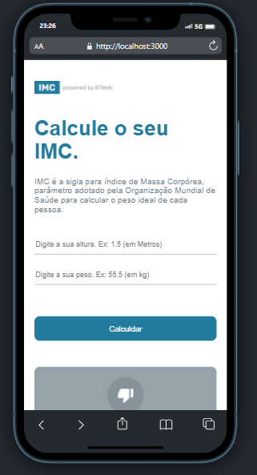
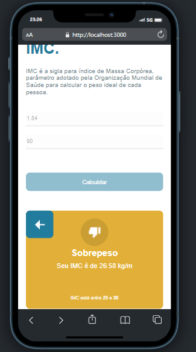

# Calculadora de IMC 

Projeto de uma calculadora de IMC simples.

## Descrição: 

-> Este projeto é um módulo das classes React do B7Web. Neste projeto eu me concentro em praticar minha organização de pastas e o uso dos princípios do React.

[x] Assets -> Pasta responsável por conter as imagens e ícones utilizados nos projetos. 
[x] Components -> Pasta contendo os componentes do projeto. 
[x] Hooks -> Contém meus hooks customizados que são usados ​​em home. 
[x] Pages -> Região que contém as páginas do projeto. 
[x] Styles -> Região que contém todos os estilos do projeto. 

### Assets:

-> Nesse caso, essa pasta contém apenas os ícones utilizados. No caso, deslike, like, seta e ícone da logo.

### Components: 

-> GridItem.tsx é responsável por modelar o elemento que descreve os estados imc. Ele recebe os dados de cada estado IMC através do item (que possui um tipo criado no hook useIMC.ts). 
-> Header.tsx contém a estrutura do cabeçalho da página. 

### Hooks: 

-> useIMC.ts contém a digitação dos "dados" que são utilizados para preencher os cartões que descrevem os tipos de IMC. Outro ponto, este arquivo tem os "dados usados" para preencher os cartões. Além disso, possui a função que calcula o IMC do usuário.

### Pages:

-> Ele contém apenas uma página, a home neste caso, que é responsável por estruturar o app.

### OBS: 

Este projeto é responsivo.

